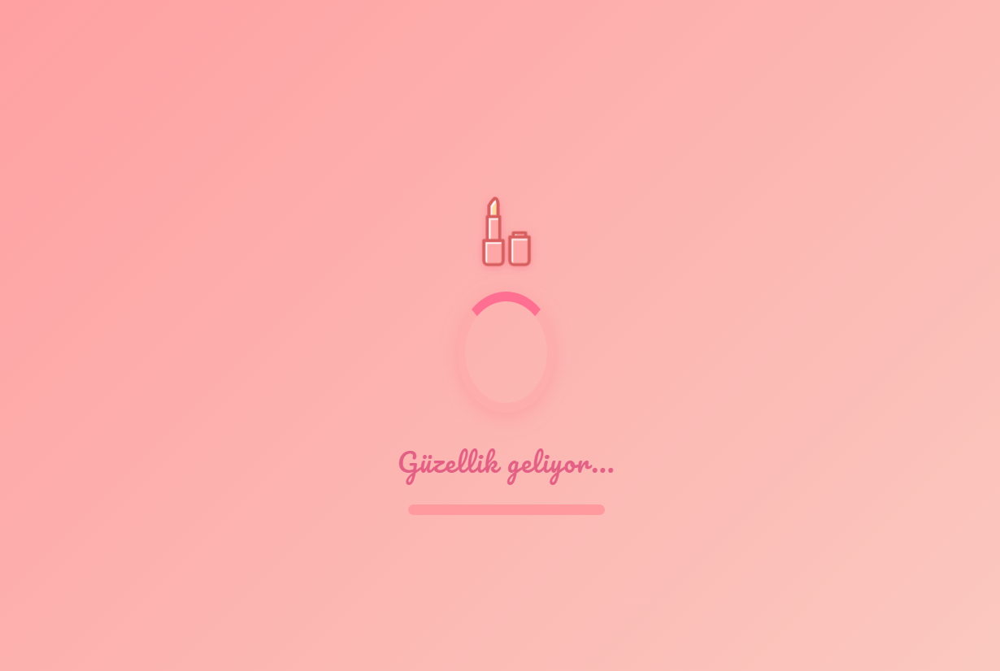

# 💄 CSS Güzellik Temalı Loader Animasyonu

Bu proje, **güzellik ve makyaj temalı** bir **CSS yükleniyor (loader) animasyonu** sunar. HTML ve CSS kullanılarak sıfırdan geliştirilmiş bu animasyon, responsive (mobil uyumlu) yapısıyla tüm cihazlarda sorunsuz çalışır.

---

## ✨ Özellikler

- 💋 Ruj simgeli estetik yükleme ekranı
- 🎨 Pastel tonlarda degrade (gradient) arka plan
- 🔄 Dönerek animasyon yapan "spinner"
- 💗 Nabız (pulse) efektiyle vurgulanan ikon
- 📊 Doluşan ilerleme çubuğu (progress bar)
- 📱 **Responsive tasarım:** Mobil, tablet ve masaüstü uyumlu

---

## 📁 Dosya Yapısı

```
CSS Loader/
│
├── index.html (Ana HTML dosyası)            
├── loader.css (Stil dosyası)       
├── lipstick.svg (Ruj ikonunu içeren SVG dosyası)
├── LICENSE (MIT lisans metni)
└── README.md (Bu döküman)
```
> Not: `lipstick.svg` dosyasını projeye dahil etmeyi unutma. Ücretsiz bir SVG ikon bulmak için önerilen kaynaklar aşağıdadır.

---

## 🔧 Nasıl Kullanılır?

1. Projeyi bilgisayarına klonla veya indir:
   ```bash
   git clone https://github.com/kullaniciadi/css-loader.git
2. `index.html` dosyasını bir tarayıcıda aç.
3. Ruj ikonlu güzellik temalı yükleme ekranını izle!

---

## 🧪 Teknolojiler

- HTML5
- CSS3 (Animasyonlar & Responsive Tasarım)
- Google Fonts: [`Pacifico`](https://fonts.google.com/specimen/Pacifico)

---

## 📸 Proje Önizleme ve Ekran Görüntüsü

Güzellik temasını yansıtan şık bir yükleniyor animasyonu.

[Proje Önizleme](https://semanurakts.github.io/CSSLoader(index.html))



---

## 🔓 Lisans

Bu proje kişisel ve eğitim amaçlı kullanımlar için tamamen ücretsizdir. Ticari projelerinizde kullanmadan önce ikon lisanslarını kontrol edin.

---

## 👩‍💻 Geliştirici

**SemaNur Aktaş** 
[Github](https://github.com/semanurakts) | [LinkedIn](https://www.linkedin.com/in/semanuraktas/)